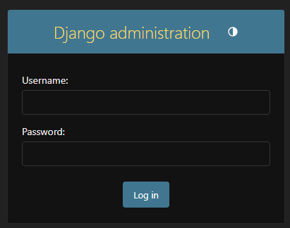

### Autorzy (Informatyka 2023/2024 Semestr 2. - Grupa Ćwiczeniowa nr. 2):
- #### Krzysztof Hager 52687 - Lider "Kszyszka@Github"
- #### Elian Godyń 52678 - "Eli3001@Github"
- #### Jakub Grzęda 52682 - "Keczuk@Github"
- #### Kacper Grzesik 52684 - "kgrzesik17@Github"
- #### Michał Fuławka 52675 - "MichalFulawka330@Github"
## [Link do repozytorium](https://github.com/Kszyszka/zabka-learning) - https://github.com/Kszyszka/zabka-learning
# Raport: Projekt Zaliczeniowy - Platforma e-learningowa z quizami i śledzeniem postępów. (***Qmaj Rzabe***)

## Wprowadzenie

Poniższy dokument zawiera dokumentację funkcjonalności każdego modułu (aplikacji) z projektu zabka-learning:
- HomeAPP
- UsersAPP
- QuizAPP
- TestsAPP

Wszystkie informacje w tym dokumencie odnoszą się do:
- project/static
- project/templates
- poject/(Aplikacje)

## HomeAPP
Jest to aplikacja obsługująca domyślny widok (stronę główną), oraz wszystkie wychodzące z niej połączenia:

1. Mainpage - Przenosi do panelu logowania/rejestracji (UsersAPP) lub do wykonania testu z poziomu Gościa (dostępne wszystkie Quizy na platformie).

2. Aboutus - Strona informacyjna, czym jest projekt qmaj rzabe.

3. Regulamin - Regulamin korzystania z aplikacji, wyświetlany jest plik static/terms.pdf w dedykowanym iframe.

4. Contact - Strona do kontaktu (można uzupełnić własne dane) oraz lokalizacji (OpenStreetMap).

## UsersAPP
UsersAPP to przedłużenie wbudowanego Django Auth, do logowania oraz rejestracji użytkowników. Konta mogą być usuwane oraz zarządzane z poziomu panelu administracyjengo (login: admin; hasło: admin).

1. Login - aplikacja do logowania użytkownika, redirect do QuizAPP

2. Signup - aplikacja do tworzenia użytkownika w bazie, automatycznie jest on logowany i przekierowywany do QuizAPP

3. Panel administracyjny - dostępny jest pod http://127.0.0.1:8000/admin; Wymaga bycia zalogowanym na konto administracyjne (domyślnie admin:admin), można dodać kolejnych użytkowników administracyjnych z jego poziomu, usuwać użytkowników, quizy, pytania, etc.

## QuizAPP
Jest to główna aplikacja, obsługująca backend, panel użytkownika oraz zarządzanie Quizami:

1. Struktura quizu i pytań w bazie danych (ORM):

2. Podmoduły zawarte w QuizAPP:
    - Wyświetlanie listy quizów stworzonych obecnie zalogowanego użytkownika (z redirectem na detale odnośnie danego quizu – lista pytań i poprawne odpowiedzi).

    - Stwórz quiz

    - Rozpocznij nowy quiz (należący do ciebie), przekierowuje do TestsAPP

    - Statystyki rozwiązanych quizów (należących do ciebie)

## TestsAPP
Jest to aplikacja obsługująca rozwiązywanie testów przez użytkowników, zarówno zalogowanych jak i Gości (identyfikator użytkownika podaje się wtedy przy rozwiązywaniu testów).

1. Rozwiązywanie jako zalogowany użytkownik, z poziomu Panelu Użytkownika.

2. Rozwiązywanie jako Gość, z panelu Strony Głównej (HomeAPP).

Odpowiedzi zapisywane sa jako podejścia w bazie danych, do Test Attemps. Potem przekazywane są do QuizAPP, z poziomu którego widoczne są statystyki Quizów.